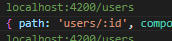
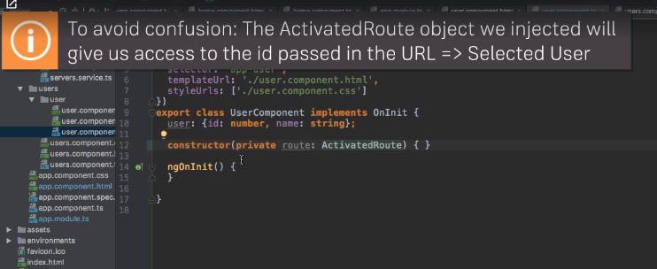
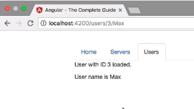
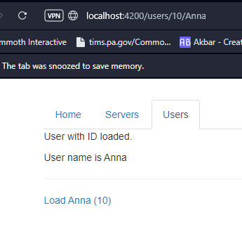
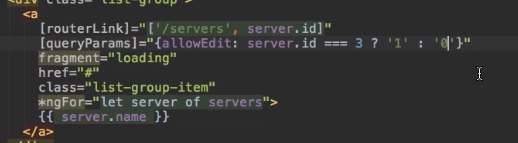
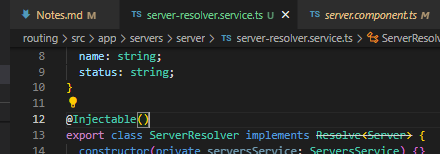

### 1. Why do we need a router?

In our app, we got three sections:

1. Home
2. Servers
    -View and Edit Servers
    - A Service is used to load and update Servers
3. Users
    - View Users

This app will be improved by adding routing but definitely feel free to play around with it - besides routing, everything should be working fine.

*This only works with Bootstrap 3*

**We are going to be splitting components up into the different tabs**

### 2. Setting up and Loading Routes

In the "app.module.ts", is where we will notify Angular the routes our app has...

Lets Angular know we want to load a particular element in the currently selected route:

Links not quite working, that will come next! It can load in the address bar for right now.

### 3. Navigating with Router Links

Oh wow! So with this new element it's actually pretty quick to get to a different page :D

routerLink=""
OR
[routerLink]=['/', '/']

### 4. Understanding Navigation Paths

/servers <-- absolute paths>

relative paths:
servers
./servers

../servers <-- Go back a few paths>

### 5. Styling Active Router Links

Going to set the tabs dynamically, so it shows it's selected

You can add this in the "a" tag, or in the list tag!

NOW it only shows the "active" tab

### 6. Navigating Programmatically

We make a button to hop to the Servers tab

### 7. Using Relative Paths in Programmatic Navigation

Made a button that does not work

### 8. Passing Parameters to Routes

in "app.module.ts" this is a dynamic path segment, so when you paste ANYTHING after the slash in the URL it will lead to the User(s) page

### 9. Fetching Route Parameters

So now with the URL, it loads based on the number in the users list, and the name

### 10. Fetching Route Parameters Reactively

Angular won't delete the old component if you are already on the page!

To reach to susequent changes, you need to route using "params".

Params is an *observable*, they are a feature by some 3rd party, heavily used by Angular, to work with asynchronous tasks!

Button specifically to load user 'Anna'

### 11. An Important Note about Route Observables

Angular cleans up the structure if a component is destroyed. Once you leave the page a new one will be created, the subscription will stay though!

You can add the OnDestroy if you want, but Angular alreadu does this manually.

### 12. Passing Query Parameters and Fragments

?mode=editing#loading <--- Query Parameters in the URL

[queryParams]="" <-- another bindable property of the routerLink Directive

**Bug 1: For some reason, my URL is not updating properly, however I am able to navigate the rest just fine. Saving bug for later**

### 13. Retrieving Query Parameters and Fragments

... i'm not sure what occured here.

### 14. Practicing and some Common Gotchas

Now we have the servers working with one another!

What about the sub servers in the URL? What do we do about using a single URL and not a new one for every single page!

### 15. Setting up Child (Nested) Routes
Load the page next to the menu, not to an entirely new page!

### 16. Using Query Parameters - Practice

*THIS is what I need in the TaskIt app! Need to grab the ability to edit from this...*

Need to fix the information from the server... in next video

In server.components.ts. 

*If the server id, is not three, then it shall be, zero!*

### 17. Configuring the Handling of Query Parameters

*To be improved on a later series, we still load the wrong server at the end of this part because the ID passed in the URL in the server component!*

Bug 2: it's under the edit.server.component.ts, won't load error!

### 18. Redirecting and Wildcard Routes

What happens when we mess with the URL manually? We end up with an error! Time to create a 404 page!!

### 19. Redirection Path Matching

In our example, we didn't encounter any issues when we tried to redirect the user. But that's not always the case when adding redirections.

By default, Angular matches paths by prefix. That means, that the following route will match both /recipes and just /

{ path: '', redirectTo: '/somewhere-else' }

Actually, Angular will give you an error here, because that's a common gotcha: This route will now ALWAYS redirect you! Why?

Since the default matching strategy is "prefix" , Angular checks if the path you entered in the URL does start with the path specified in the route. Of course every path starts with '' (Important: That's no whitespace, it's simply "nothing").

To fix this behavior, you need to change the matching strategy to "full" :

{ path: '', redirectTo: '/somewhere-else', pathMatch: 'full' }
Now, you only get redirected, if the full path is '' (so only if you got NO other content in your path in this example).

### 20. Outsourcing the Route Configuration

We have done some spring cleaning in the app module

### 21. An Introduction to Guards

We are going to fake an authentication?

### 22. Protecting Routes with canActivate

...

### 23. Protecting Child (Nested) Routes with canActivateChild

...

### 24. Using a Fake Auth Service

... Redirected to a login and logout button (that is fake!)

*Will need this fake login for the TaskIT app!*

### 25. Controlling Navigation with canDeactivate

Are you allowed to leave a route or not?

Ask "Do you really want to leave?" before you leave updating a server...

Wow! Found a fix for Bug #2...but gained Bug #3

### 26. Passing Static Data to a Route

How to get some data, static or dynamic once a route is loaded...

### 27. Resolving Dynamic Data with the resolve Guard

If you want to use a service in a service, you need to inject it

View the loading of our data in advance

### 28. Understanding Location Strategies

Cleaned up... some code

### 29. Wrap Up

Routing is a key task... in any app.

This is not something you should take for granted, your domain servers hosting on a REAL server this may not work out of the box. Routes/URL are always parsed-handled. By the server that boosts your app.

In the dev server, it has a special config. It has to be config in case a 404 it returns the html.index file to start the Angular app.

We used guards, children routes, routing, styling active links, styling the URL...

==================================
## Bug List:
1. (Video 12)
2. (Video 18) SOLVED! In Video 25, need to update edit-server.component
3. (Video 25)

Error: src/app/auth-guard.service.ts:7:30 - error TS2307: Cannot find module 'rxjs/Observable' or its corresponding type declarations.

7   import { Observable } from 'rxjs/Observable';

Error: src/app/auth-guard.service.ts:13:48 - error TS2552: Cannot find name 'CanActivateChild'. Did you mean 'CanActivate'?

13 export class AuthGuard implements CanActivate, CanActivateChild{