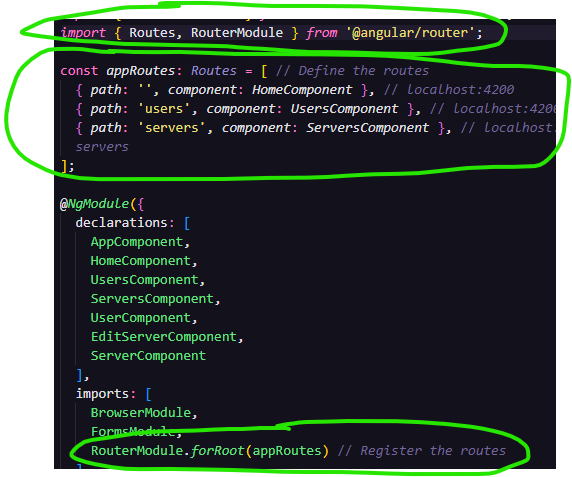
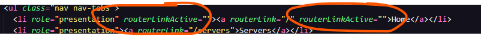
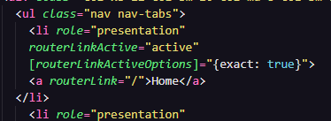
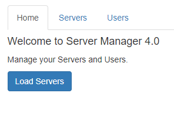

### 1. Why do we need a router?

In our app, we got three sections:

1. Home
2. Servers
    -View and Edit Servers
    - A Service is used to load and update Servers
3. Users
    - View Users

This app will be improved by adding routing but definitely feel free to play around with it - besides routing, everything should be working fine.

*This only works with Bootstrap 3*

**We are going to be splitting components up into the different tabs**

### 2. Setting up and Loading Routes

In the "app.module.ts", is where we will notify Angular the routes our app has...

Lets Angular know we want to load a particular element in the currently selected route:

Links not quite working, that will come next! It can load in the address bar for right now.

### 3. Navigating with Router Links

Oh wow! So with this new element it's actually pretty quick to get to a different page :D

routerLink=""
OR
[routerLink]=['/', '/']

### 4. Understanding Navigation Paths

/servers <-- absolute paths>

relative paths:
servers
./servers

../servers <-- Go back a few paths>

### 5. Styling Active Router Links

Going to set the tabs dynamically, so it shows it's selected

You can add this in the "a" tag, or in the list tag!

NOW it only shows the "active" tab

### 6. Navigating Programmatically

We make a button to hop to the Servers tab

### 7. Using Relative Paths in Programmatic Navigation

